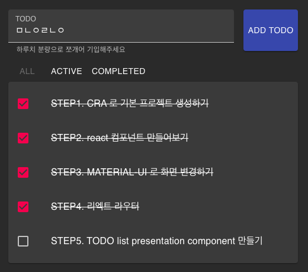
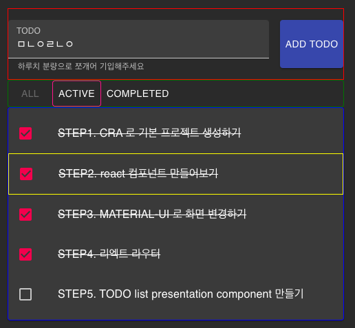
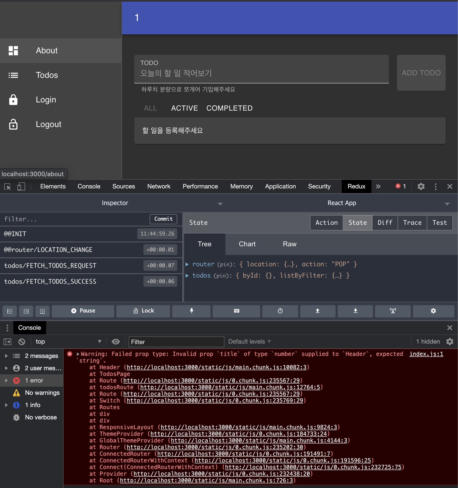
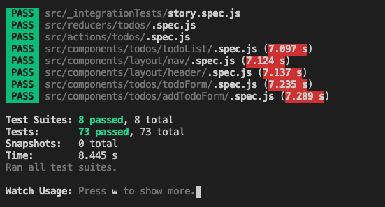

# 웹프론트 실습교육 v2.0

## **STEP1. CRA 로 기본 프로젝트 생성하기**

### 작업환경 구성

> 1.1 **작업환경 준비** > [https://react.vlpt.us/basic/02-prepare.html](https://react.vlpt.us/basic/02-prepare.html)

> 1.2 vscode 설치 및 터미널에서 실행하기
> [https://devkimgoon.tistory.com/6](https://devkimgoon.tistory.com/6)

> 1.3 리액트 개발 할 때 사용하면 편리한 도구들 - Prettier, ESLint, Snippet
> [https://react.vlpt.us/basic/27-useful-tools.html](https://react.vlpt.us/basic/27-useful-tools.html)

> 리엑트 입문 이론 [https://react.vlpt.us/basic/](https://react.vlpt.us/basic/)

### 프로젝트 생성

```jsx
npx create-react-app my-app
```

설치 안될때 node —version 확인 필요

### 실행

```jsx
yarn start
```

[http://localhost:3000](http://localhost:3000) 에서 확인하기

## **STEP2. react 컴포넌트 만들어보기**

### hello world

```jsx
function App() {
  return <div>hello world</div>
}

export default App
```

### 기본 문법 체크해보기

> JSX의 기본 규칙 알아보기 [https://react.vlpt.us/basic/04-jsx.html](https://react.vlpt.us/basic/04-jsx.html)

### 테스트

```jsx
yarn test
```

실행해서 테스트 통과해보기

```jsx
import { render, screen } from "@testing-library/react"
import App from "./App"

test("renders hello world text", () => {
  render(<App />)
  const el = screen.getByText(/hello world/i)
  expect(el).toBeInTheDocument()
})
```

## STEP3. MATERIAL-UI 로 화면 변경하기

> MATERIAL-UI
> [https://material-ui.com/](https://material-ui.com/)

React + MUI
[https://www.youtube.com/watch?v=pHclLuRolzE&list=PLQg6GaokU5CwiVmsZ0d_9Zsg_DnIP_xwr](https://www.youtube.com/watch?v=pHclLuRolzE&list=PLQg6GaokU5CwiVmsZ0d_9Zsg_DnIP_xwr)

### mui 설치

```jsx
yarn add @material-ui/core @material-ui/icons @material-ui/lab
```

### themeProvider 를 이용한 Dark theme 구현하기

> Customization Theming
> [https://material-ui.com/customization/theming/](https://material-ui.com/customization/theming/)

```jsx
import React from "react"
import { createMuiTheme, CssBaseline, ThemeProvider } from "@material-ui/core"
import App from "./App"

const theme = createMuiTheme({
  palette: {
    type: "dark",
  },
})

function Root() {
  return (
    <ThemeProvider theme={theme}>
      <CssBaseline />
      <App />
    </ThemeProvider>
  )
}

export default Root
```

### 기본 반응형 레이아웃 구성하기

- 공통 header 형 레이아웃
- 개별 header 형 레이아웃

### 절대경로를 사용하여 모듈 임포트하기

jsconfig.json 으로 경로 단순화 하기

```jsx
{
    "compilerOptions": {
        "baseUrl": "src",
        "paths": {
            "*": [
                "*",
                "src/*"
            ]
        }
    },
    "include": ["src"]
}
```

## STEP4. 리엑트 라우터

리엑트 라우터 써드파티 라이브러리 설치 [https://reactrouter.com/web/guides/quick-start](https://reactrouter.com/web/guides/quick-start)

```jsx
yarn add react-router-dom
```

Root.js 에 Router 추가

```jsx
import { BrowserRouter as Router } from "react-router-dom"
import Routes from "routes"

const Root = () => {
  return (
    <Router>
      <GlobalThemeProvider>
        <Routes />
      </GlobalThemeProvider>
    </Router>
  )
}

export default Root
```

Routes 정보 추가

```jsx
import { Route, Switch } from "react-router-dom"
import { AboutPage, TodosPage, LoginPage, NoMatchPage } from "pages"

const Routes = () => {
  const todosRoute = ({ match }) => (
    <React.Fragment>
      <Route exact path={match.url} component={TodosPage} />
      {/* <Route exact path={match.url + "/:filter"} component={TodosPage} /> */}
    </React.Fragment>
  )

  return (
    <Switch>
      <Route exact path="/" component={AboutPage} />
      <Route path="/about" component={AboutPage} />
      <Route path="/todos" component={todosRoute} />
      <Route path="/login" component={LoginPage} />
      <Route component={NoMatchPage} />
    </Switch>
  )
}
```

Page 추가

```jsx
const AboutPage = () => {
  return (
    <>
      <Header title="About" />
      <App />
    </>
  )
}
```

Nav 에 메뉴추가

```jsx
import { Link } from "react-router-dom"

const initNav = [
  { title: "About", to: "/about", icon: <DashboardIcon /> },
  { title: "Todos", to: "/todos", icon: <ListIcon /> },
  { title: "Login", to: "/login", icon: <LockIcon /> },
]

const Nav = () => {
  return (
    <List>
      {initNav.map((item) => (
        <ListItem button key={item.title} component={Link} to={item.to}>
          <ListItemIcon>{item.icon}</ListItemIcon>
          <ListItemText primary={item.title} />
        </ListItem>
      ))}
      <ListItem button key="Logout">
        <ListItemIcon>
          <LockOpenIcon />
        </ListItemIcon>
        <ListItemText primary="Logout" />
      </ListItem>
    </List>
  )
}
```

## STEP5. TODO list presentation component 만들기

### TODO list 화면



### 컴포넌트 나누기



### 각 컴포넌트 MUI로 조립해서 만들기

TodosPage.js

```jsx
import React from "react"
import { FilterMenu, Header, TodoForm, TodoList } from "components"
import { Paper } from "components/elements"

const todos = [
  { id: 1, text: "STEP1. CRA 로 기본 프로젝트 생성하기", completed: true },
  { id: 2, text: "STEP2. react 컴포넌트 만들어보기", completed: true },
  { id: 3, text: "STEP3. MATERIAL-UI 로 화면 변경하기", completed: true },
  { id: 4, text: "STEP4. 리엑트 라우터", completed: true },
  { id: 5, text: "STEP5. TODO list  presentation component 만들기", completed: false },
]

const TodosPage = () => {
  return (
    <>
      <Header title="Todos" />
      <TodoForm />
      <FilterMenu />
      <Paper>
        <TodoList data={todos} />
      </Paper>
    </>
  )
}

export default TodosPage
```

TodoForm.js

useCallback 은 특정 함수를 새로 만들지 않고 재사용 [https://react.vlpt.us/basic/18-useCallback.html](https://react.vlpt.us/basic/18-useCallback.html)

입력창에 내용 없을때 버튼 비활성화

```jsx
const TodoForm = () => {
  const classes = useStyles()
  const [value, setValue] = useState("")

  const handleChange = useCallback(({ target: { value } }) => {
    setValue(value)
  }, [])

  const handleSubmit = useCallback(
    (event) => {
      event.preventDefault()
      if (!value.trim()) return
      setValue("")
    },
    [value]
  )

  return (
    <form onSubmit={handleSubmit} autoComplete="off" className={classes.form}>
      <TextField
        onChange={handleChange}
        id="todo-title"
        label="TODO"
        value={value}
        placeholder="오늘의 할 일 적어보기"
        helperText="하루치 분량으로 쪼개어 기입해주세요"
        fullWidth
        margin="normal"
        variant="filled"
        InputLabelProps={{
          shrink: true,
        }}
      />
      <Button
        disabled={value.trim().length <= 0}
        variant="contained"
        color="primary"
        className={classes.button}
        type="submit"
      >
        Add Todo
      </Button>
    </form>
  )
}
```

FilterMenu.js

```jsx
import { FilterLink } from "components"
import { ButtonGroup } from "components/elements"
import { useParams } from "react-router-dom"

const FilterMenu = () => {
  const { filter } = useParams()
  return (
    <ButtonGroup fullWidth variant="outlined" size="small">
      <FilterLink filter="all" active={filter === "all"}>
        All
      </FilterLink>
      <FilterLink filter="active" active={filter === "active"}>
        Active
      </FilterLink>
      <FilterLink filter="completed" active={filter === "completed"}>
        Completed
      </FilterLink>
    </ButtonGroup>
  )
}
```

FilterLink.js

```jsx
const FilterLink = ({ filter, active, children }) => {
  return (
    <Button
      component={Link}
      to={filter === "all" ? "/todos/all" : "/todos/" + filter}
      disabled={!!active}
    >
      {children}
    </Button>
  )
}
```

TodoList.js

```jsx
const TodoList = ({ data = [] }) => {
  return (
    <List>
      {data.length > 0 ? (
        data.map((todo) => <TodoListItem key={todo.id} {...todo} />)
      ) : (
        <ListItem>할 일을 등록해주세요</ListItem>
      )}
    </List>
  )
}
```

TodoListItem.js

```jsx
const TodoListItem = ({ id, completed, text }) => {
  const handleTggle = useCallback(() => console.log("handleTggle TodoId : " + id), [id])
  return (
    <ListItem
      onClick={handleTggle}
      style={{
        textDecoration: completed ? "line-through" : "none",
      }}
    >
      <ListItemIcon>
        <Checkbox edge="start" checked={completed} tabIndex={-1} disableRipple />
      </ListItemIcon>
      <ListItemText>{text}</ListItemText>
    </ListItem>
  )
}
```

## STEP6. Redux 와 기타 라이브러리 적용

### 라이브러리 설치

redux 기본 설치

```jsx
yarn add redux react-redux redux-devtools-extension
```

redux 비동기 미들웨어 redux-thunk 와 axios 및 기타 라이브러리 설치

```jsx
yarn add redux-thunk axios connected-react-router history normalizr
```

> Connected React Router
> 리덕스에서 주소를 변경 및 확인하기 위해 history객체를 관리하며 필요에 의해 꺼내쓸 수 있는 유용한 라이브러리이다

history 는 4.10.1 설치 필요 5.x 에서 버그

normalizr - JSON 데이터 정규화
[https://jbee.io/react/react-redux-normalize/](https://github.com/paularmstrong/normalizr)

### 라이브러리 셋팅

src/index.js

```jsx
import React from "react"
import ReactDOM from "react-dom"
import reportWebVitals from "./reportWebVitals"
import configureStore, { history } from "stores"
import { Root } from "components"

const store = configureStore()

ReactDOM.render(<Root store={store} history={history} />, document.getElementById("root"))

reportWebVitals()
```

store/index.js

```jsx
import { createStore, applyMiddleware } from "redux"
import ReduxThunk from "redux-thunk"
import rootReducer from "reducers"
import { composeWithDevTools } from "redux-devtools-extension"
import { createBrowserHistory } from "history"
import { routerMiddleware } from "connected-react-router"

export const history = createBrowserHistory()
const middleWares = [routerMiddleware(history), ReduxThunk]
const configureStore = () => {
  const store = createStore(
    rootReducer(history),
    composeWithDevTools(applyMiddleware(...middleWares))
  )
  return store
}

export default configureStore
```

reducers/index.js

```jsx
import { combineReducers } from "redux"
import { connectRouter } from "connected-react-router"
import todos from "./todos.reducer"

const rootReducer = (history) =>
  combineReducers({
    router: connectRouter(history),
    todos,
  })

export default rootReducer
```

## STEP7-1. TODO List > 목록 불러오기 Redux 구현하기

> 리덕스 이론 [https://react.vlpt.us/redux/](https://react.vlpt.us/redux/)
> 컴포넌트들의 상태 관련 로직들을 다른 파일들로 분리

> todo-api 서버
> git clone git@github.daumkakao.com:joseph-choi/todo-api.git

### 공통파일

.env

```jsx
REACT_APP_API_URL=http://localhost:8000
```

apis/api.js

```jsx
import axios from "axios"

const baseURL = process.env.REACT_APP_API_URL

const api = axios.create({
  baseURL,
  headers: {
    "X-Requested-With": "XMLHttpRequest",
  },
  withCredentials: true,
})

api.interceptors.request.use(
  (config) => config,
  (error) => Promise.reject(error)
)

api.interceptors.response.use(
  (response) => response.data,
  (error) => {
    if (error.response.status === 401 && window.location.pathname !== "/login") {
      window.location.href = "/login"
    }
    return Promise.reject(error)
  }
)

export default api
```

actions/scheme.js

```jsx
import { schema } from "normalizr"

export const todo = new schema.Entity("todos")
export const arrayOfTodo = new schema.Array(todo)
```

### TODO list 관련 파일

apis/todos.api.js

```jsx
import api from "./api"

const todoApi = {
  fetchTodos,
}
export default todoApi

function fetchTodos(filter = "all") {
  return api.get(`/api/todos/${filter}`)
}
```

actions/todos.action.js

```jsx
import { normalize } from "normalizr"
import { todoApi } from "apis"
import * as schema from "./schema"
import { getIsFetching } from "reducers/todos.reducer"
export const FETCH_TODOS_REQUEST = "todos/FETCH_TODOS_REQUEST"
export const FETCH_TODOS_SUCCESS = "todos/FETCH_TODOS_SUCCESS"
export const FETCH_TODOS_FAILURE = "todos/FETCH_TODOS_FAILURE"

export const fetchTodos = (filter) => (dispatch, getState) => {
  if (getIsFetching(getState(), filter)) {
    return Promise.resolve()
  }

  dispatch(request())

  return todoApi
    .fetchTodos(filter)
    .then((response) => dispatch(success(response)))
    .catch((err) => dispatch(failure(err)))

  function request() {
    return {
      type: FETCH_TODOS_REQUEST,
      filter,
    }
  }

  function success(response) {
    return {
      type: FETCH_TODOS_SUCCESS,
      filter,
      response: normalize(response, schema.arrayOfTodo),
    }
  }

  function failure(error) {
    return {
      type: FETCH_TODOS_FAILURE,
      filter,
      message: error ? error.message : "Something went wrong.",
    }
  }
}
```

reducers/todos/byId.js

```jsx
const byId = (state = {}, action) => {
  if (action && action.response) {
    return {
      ...state,
      ...action.response.entities.todos,
    }
  }
  return state
}

export default byId

export const getTodo = (state, id) => state[id]
```

reducers/todos/createList.js

```jsx
import { combineReducers } from "redux"
import { FETCH_TODOS_REQUEST, FETCH_TODOS_SUCCESS, FETCH_TODOS_FAILURE } from "actions/todos.action"

const createList = (filter) => {
  const ids = (state = [], action) => {
    switch (action.type) {
      case FETCH_TODOS_SUCCESS:
        return filter === action.filter ? action.response.result : state
      default:
        return state
    }
  }

  const isFetching = (state = false, action) => {
    if (filter !== action.filter) {
      return state
    }
    switch (action.type) {
      case FETCH_TODOS_REQUEST:
        return true
      case FETCH_TODOS_SUCCESS:
      case FETCH_TODOS_FAILURE:
        return false
      default:
        return state
    }
  }

  const errorMessage = (state = null, action) => {
    if (filter !== action.filter) {
      return state
    }
    switch (action.type) {
      case FETCH_TODOS_FAILURE:
        return action.message
      case FETCH_TODOS_REQUEST:
      case FETCH_TODOS_SUCCESS:
        return null
      default:
        return state
    }
  }

  return combineReducers({
    ids,
    isFetching,
    errorMessage,
  })
}

export default createList

export const getIds = (state) => state.ids
export const getIsFetching = (state) => state.isFetching
export const getErrorMessage = (state) => state.errorMessage
```

reducers/todos.reducer.js

```jsx
import { combineReducers } from "redux"
import byId, * as fromById from "./todos/byId"
import createList, * as fromList from "./todos/createList"

const listByFilter = combineReducers({
  all: createList("all"),
  active: createList("active"),
  completed: createList("completed"),
})

const todos = combineReducers({
  byId,
  listByFilter,
})

export default todos

export const getVisibleTodos = ({ todos }, filter) => {
  const ids = fromList.getIds(todos.listByFilter[filter])
  return ids.map((id) => fromById.getTodo(todos.byId, id))
}

export const getIsFetching = ({ todos }, filter) =>
  fromList.getIsFetching(todos.listByFilter[filter])

export const getErrorMessage = ({ todos }, filter) =>
  fromList.getErrorMessage(todos.listByFilter[filter])
```

TodosPage.js

```jsx
import React from "react"
import { FilterMenu, Header, TodoForm, TodoList } from "components"
import { Paper } from "components/elements"

const todos = [
  { id: 1, text: "STEP1. CRA 로 기본 프로젝트 생성하기", completed: true },
  { id: 2, text: "STEP2. react 컴포넌트 만들어보기", completed: true },
  { id: 3, text: "STEP3. MATERIAL-UI 로 화면 변경하기", completed: true },
  { id: 4, text: "STEP4. 리엑트 라우터", completed: true },
  { id: 5, text: "STEP5. TODO list  presentation component 만들기", completed: false },
]

const TodosPage = () => {
  return (
    <>
      <Header title="Todos" />
      <TodoForm />
      <FilterMenu />
      <Paper>
        <TodoList data={todos} />
      </Paper>
    </>
  )
}

export default TodosPage
```

VisibleTodoList.js

todos 데이터를 불러오는 TodoList 의 container component 추가

```jsx
import React, { useCallback, useEffect } from "react"
import { useDispatch, useSelector } from "react-redux"
import { useParams } from "react-router-dom"
import { TodoList, FetchError } from "components"
import { LinearProgress } from "components/elements"
import { getVisibleTodos, getIsFetching, getErrorMessage } from "reducers/todos.reducer"
import { fetchTodos } from "actions/todos.action"

function useLoading(filter) {
  const dispatch = useDispatch()
  const data = useSelector((state) => getVisibleTodos(state, filter), [filter])
  const isFetching = useSelector((state) => getIsFetching(state, filter), [filter])
  const errorMessage = useSelector((state) => getErrorMessage(state, filter), [filter])
  const handleFetch = useCallback(() => dispatch(fetchTodos(filter)), [dispatch, filter])

  useEffect(() => {
    dispatch(fetchTodos(filter))
  }, [dispatch, filter])

  return {
    data,
    isFetching,
    errorMessage,
    onFetch: handleFetch,
  }
}

const VisibleTodoList = () => {
  const params = useParams()
  const filter = params.filter || "all"
  const { data, isFetching, errorMessage, onFetch } = useLoading(filter)

  if (isFetching && !data.length) {
    return <LinearProgress />
  }

  if (errorMessage && !data.length) {
    return <FetchError message={errorMessage} onRetry={onFetch} />
  }

  return <TodoList data={data} />
}

export default VisibleTodoList
```

TodoPage.js

```jsx
import React from "react"
import { FilterMenu, Header, TodoForm, VisibleTodoList } from "components"
import { Paper } from "components/elements"

const TodosPage = () => {
  return (
    <>
      <Header title="Todos" />
      <TodoForm />
      <FilterMenu />
      <Paper>
        <VisibleTodoList />
      </Paper>
    </>
  )
}

export default TodosPage
```

## STEP7-2. TODO List > 목록에서 완료 처리 추가

apis/todos.api.js

```jsx
import api from "./api"

const todoApi = {
  toggleTodo,
}
export default todoApi

function toggleTodo(id) {
  return api.put(`/api/todos/${id}/change`)
}
```

actions/todos.action.js 추가

```jsx
export const TOGGLE_TODO_SUCCESS = "todos/TOGGLE_TODO_SUCCESS"

export const toggleTodo = (id) => (dispatch) =>
  todoApi.toggleTodo(id).then((response) => {
    dispatch({
      type: TOGGLE_TODO_SUCCESS,
      response: normalize(response, schema.todo),
    })
  })
```

reducers/todos/createList.js

```jsx
import { combineReducers } from "redux"
import {
	...
  TOGGLE_TODO_SUCCESS,
} from "actions/todos.action"

const createList = (filter) => {
  const handleToggle = (state, action) => {
    const { result: toggledId, entities } = action.response
    const { completed } = entities.todos[toggledId]
    const shouldRemove =
      (completed && filter === "active") || (!completed && filter === "completed")
    return shouldRemove ? state.filter((id) => id !== toggledId) : state
  }

  const ids = (state = [], action) => {
    switch (action.type) {
      case FETCH_TODOS_SUCCESS:
        return filter === action.filter ? action.response.result : state
      case TOGGLE_TODO_SUCCESS:
        return handleToggle(state, action)
      default:
        return state
    }
  }

  ...
}

export default createList

...
```

TodoListItem.js

```jsx
import { toggleTodo } from "actions/todos.action"

const TodoListItem = ({ id, completed, text }) => {
  const dispatch = useDispatch()
  const handleTggle = useCallback(() => dispatch(toggleTodo(id)), [dispatch, id])
  return (
    <ListItem
      onClick={handleTggle}
      style={{
        textDecoration: completed ? "line-through" : "none",
      }}
    >
      <ListItemIcon>
        <Checkbox edge="start" checked={completed} tabIndex={-1} disableRipple />
      </ListItemIcon>
      <ListItemText>{text}</ListItemText>
    </ListItem>
  )
}
```

## STEP8. TODO List > 할일 추가하기

apis/todos.api.js

```jsx
import api from "./api"

const todoApi = {
  addTodo,
}
export default todoApi

function addTodo(text) {
  return api.post(`/api/todos`, {
    text,
  })
}
```

actions/todos.action.js 추가

```jsx
export const ADD_TODO_SUCCESS = "todos/ADD_TODO_SUCCESS"

export const addTodo = (text) => (dispatch) =>
  todoApi.addTodo(text).then((response) => {
    dispatch({
      type: ADD_TODO_SUCCESS,
      response: normalize(response, schema.todo),
    })
  })
```

reducers/todos/createList.js

```jsx
import { combineReducers } from "redux"
import {
	...
  ADD_TODO_SUCCESS,
} from "actions/todos.action"

const createList = (filter) => {
 ...

  const ids = (state = [], action) => {
    switch (action.type) {
      case FETCH_TODOS_SUCCESS:
        return filter === action.filter ? action.response.result : state
      case TOGGLE_TODO_SUCCESS:
        return handleToggle(state, action)
			case ADD_TODO_SUCCESS:
        return filter !== "completed" ? [...state, action.response.result] : state
      default:
        return state
    }
  }

  ...
}

export default createList

...
```

TodoForm.js

```jsx
import { useDispatch } from "react-redux"
import { addTodo } from "actions/todos.action"

const TodoForm = () => {
  const classes = useStyles()
  const dispatch = useDispatch()
  const [value, setValue] = useState("")
  const handleChange = useCallback(({ target: { value } }) => {
    setValue(value)
  }, [])

  const handleSubmit = useCallback(
    (event) => {
      event.preventDefault()
      if (!value.trim()) return
      dispatch(addTodo(value))
      setValue("")
    },
    [dispatch, value]
  )

  return (
    <form onSubmit={handleSubmit} autoComplete="off" className={classes.form}>
      <TextField
        onChange={handleChange}
        id="todo-title"
        label="TODO"
        value={value}
        placeholder="오늘의 할 일 적어보기"
        helperText="하루치 분량으로 쪼개어 기입해주세요"
        fullWidth
        margin="normal"
        variant="filled"
        InputLabelProps={{
          shrink: true,
        }}
      />
      <Button
        disabled={value.trim().length <= 0}
        variant="contained"
        color="primary"
        className={classes.button}
        type="submit"
      >
        Add Todo
      </Button>
    </form>
  )
}
```

저장 외에 수정할 때 TodoForm component를 재사용 가능하게 하는 방법은 무엇이 있을까요?

## STEP9. TODO List > 할일 삭제하기

apis/todos.api.js

```jsx
import api from "./api"

const todoApi = {
  removeTodo,
}
export default todoApi

function removeTodo(id) {
  return api.delete(`/api/todos/${id}`)
}
```

actions/todos.action.js 추가

```jsx
export const REMOVE_TODO_SUCCESS = "todos/REMOVE_TODO_SUCCESS"

export const removeTodo = (id) => (dispatch) =>
  todoApi.removeTodo(id).then((response) => {
    dispatch({
      type: REMOVE_TODO_SUCCESS,
      response: normalize(response, schema.todo),
    })
  })
```

reducers/todos/createList.js

```jsx
import { combineReducers } from "redux"
import {
	...
  REMOVE_TODO_SUCCESS,
} from "actions/todos.action"

const createList = (filter) => {
 ...

  const ids = (state = [], action) => {
    switch (action.type) {
      case FETCH_TODOS_SUCCESS:
        return filter === action.filter ? action.response.result : state
      case TOGGLE_TODO_SUCCESS:
        return handleToggle(state, action)
			case ADD_TODO_SUCCESS:
        return filter !== "completed" ? [...state, action.response.result] : state
      case REMOVE_TODO_SUCCESS:
        const removeId = action.response.result
        return state.filter((item) => item !== removeId)
			default:
        return state
    }
  }

  ...
}

export default createList

...
```

TodoLIstItem.js

```jsx
import React, { useCallback } from "react"
import { useDispatch } from "react-redux"
import {
  ListItem,
  ListItemIcon,
  ListItemText,
  Checkbox,
  ListItemSecondaryAction,
  IconButton,
} from "components/elements"
import { removeTodo, toggleTodo } from "actions/todos.action"
import DeleteIcon from "@material-ui/icons/Delete"

const TodoListItem = ({ id, completed, text }) => {
  const dispatch = useDispatch()
  const handleTggle = useCallback(() => dispatch(toggleTodo(id)), [dispatch, id])
  const handleRemove = useCallback(
    (e) => {
      e.preventDefault()
      e.stopPropagation()
      dispatch(removeTodo(id))
    },
    [dispatch, id]
  )
  return (
    <ListItem
      onClick={handleTggle}
      style={{
        textDecoration: completed ? "line-through" : "none",
      }}
    >
      <ListItemIcon>
        <Checkbox edge="start" checked={completed} tabIndex={-1} disableRipple />
      </ListItemIcon>
      <ListItemText>{text}</ListItemText>
      <ListItemSecondaryAction>
        <IconButton edge="end" aria-label="delete" onClick={handleRemove}>
          <DeleteIcon />
        </IconButton>
      </ListItemSecondaryAction>
    </ListItem>
  )
}

export default TodoListItem
```

# Step10. Testing Setup enzyme

## 웹프론트 테스트 고려사항

### 유닛 테스트

- [ ] 컴포넌트가 잘 랜더링된다
- [ ] 컴포넌트의 특정 매소드를 실행하면 상태가 기대하는 형태로 변경된다
- [ ] 컴포넌트의 이벤트를 실행하면 기대하는 결과가 발생한다
- [ ] 액션 생성 함수가 액션 객체를 잘 만들어 낸다
- [ ] 리듀서에 상태와 액션을 넣어서 호출하면 기대하는 형태로 변경된다

### 통합테스트

- [ ] 여러 컴포넌트들을 랜더링하고 서로 상호 작용을 잘하고 있다
- [ ] DOM에 사용자 이벤트를 발생했을때 기대하는 UI변화가 발생한다
- [ ] 리덕스와 연동된 컨테이너 컴포넌트의 DOM 에 특정 이벤트를 발생시켰을 때 우리가 원하는 액션이 잘 디스패치 된다

### 항목별 테스트

- Presentation Components
- ProTypes
- Action creators
- Reducers
- Container Components
- Simulate Events
- Methods

> enzyme [https://enzymejs.github.io/enzyme/](https://enzymejs.github.io/enzyme/)

### react 17.x

라이브러리 설치

```jsx
yarn add -D enzyme @wojtekmaj/enzyme-adapter-react-17 jest-enzyme
```

setupTest.js

```jsx
import Enzyme from "enzyme"
import Adapter from "@wojtekmaj/enzyme-adapter-react-17"

Enzyme.configure({ adapter: new Adapter() })
```

### react 16.x

라이브러리 설치

```jsx
yarn add -D enzyme enzyme-adapter-react-16 jest-enzyme
```

setupTest.js

```jsx
import Enzyme from "enzyme"
import EnzymeAdapter from "enzyme-adapter-react-16"

Enzyme.configure({
  adapter: new EnzymeAdapter(),
  disableLifecycleMethods: true,
})
```

> 사용자 스토리 만들기

\_integrationTests/story.spec.js

```jsx
describe("사용자 스토리", () => {
  describe("Todos", () => {
    describe("story-1, 할일 목록을 볼 수 있다", () => {
      describe("목록이 없을때", () => {
        test("all 탭에는 '할일이 없습니다'를 보여준다", () => {
          /**
           * component : presentation component 구현
           * component : props, state 분리, propTypes 타입체크
           * component ui event : useState, useCallbak 으로 컴포넌트 이벤트 핸들러 구현
           * data : 모델링 > 정규화 > ProTypes
           * server api : req/res 모델링
           * store : state 모델링
           * action : action type (ex: todos/FETCH_TODOS_REQUEST), action creator (ex: fetchTodos)
           * reducer : byId, createList 파일 구성 > getTodos, getIsFetching, getErrMessage selector
           * component : container component 구현
           **/
        })
        test("active 탭에는 '할일이 없습니다'를 보여준다", () => {})
        test("completed 탭에는 '할일이 없습니다'를 보여준다", () => {})
      })
      describe("목록이 있을때", () => {
        test("all 탭에는 모든 리스트를 볼 수 있다", () => {})
        test("active 탭에는 미완료된 리스트를 볼 수 있다", () => {})
        test("completed 탭에는 완료된 리스트를 볼 수 있다", () => {})
      })
    })
    describe("story-2, 할일을 추가할 수 있다", () => {
      describe("목록에서", () => {
        test("all 탭에 입력한 할일이 추가 된다", () => {})
        test("active 탭에도 입력한 할일이 추가 된다", () => {})
        test("completed 탭에는 입력한 할일이 없다", () => {})
      })
      describe("입력창에서", () => {
        describe("입력 전에는", () => {
          test("초기 입력창에 '오늘 할 일 적어보기' 문구가 보인다", () => {})
        })
        describe("입력 중에는", () => {
          test("입력창에 텍스트가 입력되면 '오늘 할 일 적어보기' 문구가 사라지고 입력하는 텍스트가 보인다", () => {})
          test("비활성화 된 'ADD TODO' 버튼이 텍스트가 입력되면 활성화 된다", () => {})
        })
        describe("입력 완료 후에는", () => {
          test("엔터를 치면 입력 완료된다", () => {})
          test("'ADD TODO' 버튼을 누르면 입력 완료된다", () => {})
          test("입력창이 초기화 되고 '오늘 할 일 적어보기'가 보인다", () => {})
          test("'ADD TODO' 버튼이 비활성화 된다", () => {})
        })
      })
    })
    describe("story-3, 할일을 완료 처리할 수 있다", () => {
      test("all 탭에 완료 표기 된다", () => {})
      test("active 탭에 완료된 할일이 없다", () => {})
      test("completed 탭에는 완료한 할일이 추가 된다", () => {})
    })
    describe("story-4, 할일을 삭제할 수 있다", () => {
      test("all 탭에 삭제한 할일 없다", () => {})
      test("active 탭에도 삭제한 할일 없다", () => {})
      test("completed 탭에는 삭제한 할일 없다", () => {})
    })
  })
})
```

스토리 기반 테스트는 ... 어떻게 해야될지.. 무엇을 고민하는지는

아래 항목별 테스트 방법 살펴보고 다시 논의하겠습니다

# Step11. Presentation Components

> className selector 대신 data-test selector 사용 권장

## 기본 프리젠테이션 컴포넌트 테스트

components/layout/Nav.js 를

components/layout/nav/index.js 로 변경합니다

```jsx
const initNav = [
  { title: "About", to: "/about", icon: <DashboardIcon /> },
  { title: "Todos", to: "/todos", icon: <ListIcon /> },
  { title: "Login", to: "/login", icon: <LockIcon /> },
]

const Nav = () => {
  return (
    <List data-test="navComponent">
      {initNav.map((item) => (
        <ListItem button key={item.title} component={Link} to={item.to}>
          <ListItemIcon>{item.icon}</ListItemIcon>
          <ListItemText primary={item.title} />
        </ListItem>
      ))}
      <ListItem button key="Logout">
        <ListItemIcon>
          <LockOpenIcon />
        </ListItemIcon>
        <ListItemText primary="Logout" />
      </ListItem>
    </List>
  )
}
```

components/layout/nav/.spec.js

```jsx
import { shallow } from "enzyme"
import { Nav } from "components"
import { List, ListItem } from "components/elements"
import { findByTestAttr } from "utils"

const setup = (props = {}) => {
  const component = shallow(<Nav {...props} />)
  return component
}

describe("Nav Component", () => {
  let component
  beforeEach(() => {
    component = setup()
  })
  it("Should render without errors using the classname", () => {
    // const component = shallow(<Nav />)
    // console.log(component.debug())
    const wrapper = component.find(".navComponent")
    expect(wrapper.length).toBe(1)
    expect(wrapper).toHaveLength(1)
  })
  it("Should render a List/ListItem Components using the classname", () => {
    // const component = shallow(<Nav />)
    expect(component.exists(List)).toBe(true)
    expect(component.exists(ListItem)).toBeTruthy
  })

  it("[recommend] Should render without errors using the data-test", () => {
    // const wrapper = component.find(`[data-test='${attr}']`)
    const wrapper = findByTestAttr(component, "navComponent")
    expect(wrapper.length).toBe(1)
  })

  it("[recommend] Should render a first listItem using the data-test", () => {
    const wrapper = findByTestAttr(component, "navComponent")
    const listItem = wrapper.childAt(0)
    expect(listItem.length).toBe(1)
    expect(listItem.props().to).toEqual("/about")
  })
})
```

utils/index.js

```jsx
export const findByTestAttr = (component, attr) => {
  const wrapper = component.find(`[data-test='${attr}']`)
  return wrapper
}
```

## props 값 존재 여부에 따른 프리젠테이션 컴포넌트 테스트

header/index.js

```jsx
const Header = ({ title = "pageTitle", leftMenu = undefined, rightMenu = undefined }) => {
  const classes = useStyles()
  return (
    <AppBar position="fixed" className={classes.appBar} data-test="headerComponent">
      <Toolbar>
        {leftMenu && <div data-test="leftMenu">{leftMenu}</div>}
        <Typography variant="h6" noWrap className={classes.subtitle} data-test="headerTitle">
          {title}
        </Typography>
        {rightMenu && <div data-test="rightMenu">{rightMenu}</div>}
      </Toolbar>
    </AppBar>
  )
}
```

header/.spec.js

```jsx
import { shallow } from "enzyme"
import { Header } from "components"
import { findByTestAttr } from "utils"
import { Delete } from "@material-ui/icons"

const setup = (props = {}) => {
  const component = shallow(<Header {...props} />)
  return component
}

describe("Header Component", () => {
  describe("Have No props", () => {
    let component
    beforeEach(() => {
      component = setup()
    })
    it("Should render without error", () => {
      const wrapper = findByTestAttr(component, "headerComponent")
      expect(wrapper).toHaveLength(1)
    })

    it("Should render the exact title", () => {
      const title = findByTestAttr(component, "componentTitle")
      expect(title.length).toBe(1)
      // console.log(title.children().debug())
      expect(title.children().text()).toBe("pageTitle")
    })

    it("Should not render a leftMenu", () => {
      const leftMenu = findByTestAttr(component, "componentLeftMenu")
      expect(leftMenu.length).toBe(0)
    })

    it("Should not render a rightMenu", () => {
      const rightMenu = findByTestAttr(component, "componentRightMenu")
      expect(rightMenu.length).toBe(0)
    })
  })
  describe("Have props", () => {
    let component
    beforeEach(() => {
      const props = {
        title: "Todos",
        leftMenu: <Delete />,
        rightMenu: "rightMenu",
      }
      component = setup(props)
    })
    it("Should render without error", () => {
      const wrapper = findByTestAttr(component, "headerComponent")
      expect(wrapper).toHaveLength(1)
    })

    it("Should render the exact title", () => {
      const title = findByTestAttr(component, "componentTitle")
      expect(title.length).toBe(1)
      // console.log(title.children().debug())
      expect(title.children().text()).toBe("Todos")
    })

    it("Should render a leftMenu", () => {
      const leftMenu = findByTestAttr(component, "componentLeftMenu")
      expect(leftMenu.length).toBe(1)
      //   console.log(leftMenu.debug())
      expect(leftMenu.exists(Delete)).toBe(true)
    })

    it("Should render a rightMenu", () => {
      const rightMenu = findByTestAttr(component, "componentRightMenu")
      expect(rightMenu.length).toBe(1)
    })
  })
})
```

# Step12. PropTypes

## 컴포넌트 Props 타입체크

header/index.js

```jsx
import PropTypes from "prop-types"

const Header = ({ title = "pageTitle", leftMenu = undefined, rightMenu = undefined }) => {
  const classes = useStyles()
  return (
    <AppBar position="fixed" className={classes.appBar} data-test="headerComponent">
      <Toolbar>
        {leftMenu && <div data-test="leftMenu">{leftMenu}</div>}
        <Typography variant="h6" noWrap className={classes.subtitle} data-test="headerTitle">
          {title}
        </Typography>
        {rightMenu && <div data-test="rightMenu">{rightMenu}</div>}
      </Toolbar>
    </AppBar>
  )
}

Header.propTypes = {
  title: PropTypes.string,
  leftMenu: PropTypes.node,
  rightMenu: PropTypes.node,
}
```

pages/TodosPage.js

```jsx
const TodosPage = () => {
  return (
    <>
		~~<Header title="Todos" />~~
		<Header title={1} />
      ...
  )
}
```

```jsx
Warning: Failed prop type: Invalid prop `title` of type `number` supplied to `Header`, expected `string`.
    at Header (http://localhost:3000/static/js/main.chunk.js:10082:3)
    at TodosPage
    at Route (http://localhost:3000/static/js/0.chunk.js:235567:29)
    at todosRoute (http://localhost:3000/static/js/main.chunk.js:12764:5)
    at Route (http://localhost:3000/static/js/0.chunk.js:235567:29)
    at Switch (http://localhost:3000/static/js/0.chunk.js:235769:29)
    at Routes
    at div
    at div
    at ResponsiveLayout (http://localhost:3000/static/js/main.chunk.js:9824:3)
    at ThemeProvider (http://localhost:3000/static/js/0.chunk.js:184733:24)
    at GlobalThemeProvider (http://localhost:3000/static/js/main.chunk.js:4144:3)
    at Router (http://localhost:3000/static/js/0.chunk.js:235202:30)
    at ConnectedRouter (http://localhost:3000/static/js/0.chunk.js:191491:7)
    at ConnectedRouterWithContext (http://localhost:3000/static/js/0.chunk.js:191596:25)
    at Connect(ConnectedRouterWithContext) (http://localhost:3000/static/js/0.chunk.js:232725:75)
    at Provider (http://localhost:3000/static/js/0.chunk.js:232438:20)
    at Root (http://localhost:3000/static/js/main.chunk.js:726:3)
```



## 테스트 Props 타입체크

> check-prop-types [https://github.com/ratehub/check-prop-types](https://github.com/ratehub/check-prop-types)

```jsx
yarn add -D check-prop-types
```

header/index.js

> react.memo propTypes 미지원 ...

```jsx
export default Header
```

header/.spec.js

```jsx
import React from "react"
import { shallow } from "enzyme"
import { findByTestAttr, checkProps } from "utils"
import { Header } from "components"
// import checkPropTypes from "check-prop-types"

const setUp = (props = {}) => {
  const component = shallow(<Header {...props} />)
  return component
}

describe("Header Component", () => {
  describe("Checking propTypes", () => {
    it("Should not throw a waring", () => {
      const expectedProps = {
        title: "Todos",
        leftMenu: <Delete />,
        rightMenu: "rightMenu",
      }
      //   const propErr = checkPropTypes(Header.propTypes, expectedProps, "props")
      const propErr = checkProps(Header, expectedProps)
      expect(propErr).toBeUndefined()
    })
    it("Should throw a waring", () => {
      const expectedProps = {
        title: 1,
        leftMenu: <Delete />,
        rightMenu: "rightMenu",
      }
      //   const propErr = checkPropTypes(Header.propTypes, expectedProps, "props")
      const propErr = checkProps(Header, expectedProps)
      expect(propErr).not.toBeUndefined()
    })
  })

  ...
})
```

utils/index.js

```jsx
import checkPropTypes from "check-prop-types"

export const checkProps = (component, expectedProps) => {
  const propsErr = checkPropTypes(component.propTypes, expectedProps, "props", component.name)
  return propsErr
}
```

## TodoList component test 실습

> story-1, 할일 목록을 볼 수 있다 > 목록이 없을때 > all 탭에는 '할일이 없습니다'를 보여준다 > TodoList component 는 탭에 상관없이 데이터가 없을때 '할일이 없습니다'를 보여준다

```jsx
 describe("사용자 스토리", () => {
  describe("Todos", () => {
    describe("story-1, 할일 목록을 볼 수 있다", () => {
      describe("목록이 없을때", () => {
        test("all 탭에는 '할일이 없습니다'를 보여준다", () => {
          /**
           * component : presentation component 구현
           * component : props, state 분리, propTypes 타입체크
           * component ui event : useState, useCallbak 으로 컴포넌트 이벤트 핸들러 구현
           * data : 모델링 > 정규화 > ProTypes
           * server api : req/res 모델링
           * store : state 모델링
           * action : action type (ex: todos/FETCH_TODOS_REQUEST), action creator (ex: fetchTodos)
           * reducer : byId, createList 파일 구성 > getTodos, getIsFetching, getErrMessage selector
           * component : container component 구현
           **/
        })
        test("active 탭에는 '할일이 없습니다'를 보여준다", () => {})
        test("completed 탭에는 '할일이 없습니다'를 보여준다", () => {})
      })
    })
```

todoList/index.js

```jsx
import React from "react"
import { TodoListItem } from "components"
import { List, ListItem } from "components/elements"
import PropTypes from "prop-types"

const TodoList = ({ data = [] }) => {
  return (
    <List data-test="todoListComponent">
      {data.length > 0 ? (
        data.map((todo) => <TodoListItem key={todo.id} {...todo} />)
      ) : (
        <ListItem data-test="componentEmpty">할 일을 등록해주세요</ListItem>
      )}
    </List>
  )
}

TodoList.propTypes = {
  data: PropTypes.array,
}

// TodoList.propTypes = {
//   data: PropTypes.arrayOf(
//     PropTypes.shape({
//       id: PropTypes.number,
//       text: PropTypes.string,
//       completed: PropTypes.bool,
//       createDate: PropTypes.string,
//     })
//   ),
// }

export default TodoList
```

todoList/.spec.js

```jsx
import { shallow } from "enzyme"
import { TodoList } from "components"
import { findByTestAttr, checkProps } from "utils"

const setup = (props = {}) => {
  const component = shallow(<TodoList {...props} />)
  return component
}

describe("TodoList Component", () => {
  describe("Checking propTypes", () => {
    it("Should not throw a waring", () => {
      const expectedProps = { data: [] }
      const propErr = checkProps(TodoList, expectedProps)
      expect(propErr).toBeUndefined()
    })
    it("Should throw a waring", () => {
      const expectedProps = { data: {} }
      const propErr = checkProps(TodoList, expectedProps)
      expect(propErr).not.toBeUndefined()
    })
  })
  describe("Have No props", () => {
    let component
    beforeEach(() => {
      component = setup()
    })
    it("Should render without error", () => {
      const wrapper = findByTestAttr(component, "todoListComponent")
      //   console.log(wrapper.debug())
      expect(wrapper).toHaveLength(1)
    })
    it("Should render a empty listItem", () => {
      const emptyListItem = findByTestAttr(component, "componentEmpty")
      //   console.log(emptyListItem.debug())
      //   console.log(emptyListItem.children().debug())
      expect(emptyListItem).toHaveLength(1)
      expect(emptyListItem.children().text()).toBe("할 일을 등록해주세요")
    })
  })

  describe("Have props", () => {
    let component
    beforeEach(() => {
      const props = {
        data: [
          {
            id: 1,
            text: "test todo 1",
            completed: false,
            createDate: "2020-12-29T00:15:07.318+00:00",
          },
          {
            id: 2,
            text: "test todo 2",
            completed: false,
            createDate: "2020-12-29T04:45:55.780+00:00",
          },
        ],
      }
      component = setup(props)
    })
    it("Should render without error", () => {
      const wrapper = findByTestAttr(component, "todoListComponent")
      expect(wrapper).toHaveLength(1)
    })
    it("Should render listItems", () => {
      const wrapper = findByTestAttr(component, "todoListComponent")
      expect(wrapper.children().length).toBe(2)
      //   console.log(wrapper.children().at(0).debug())
      expect(wrapper.children().at(0).props().text).toBe("test todo 1")
    })
  })
})
```

# Step13. Action creators

> fetchTodos action

actions/todos/index.js

```jsx
import { normalize } from "normalizr"
import { todoApi } from "apis"
import * as schema from "../schema"
import { getIsFetching } from "reducers/todos.reducer"
export const FETCH_TODOS_REQUEST = "todos/FETCH_TODOS_REQUEST"
export const FETCH_TODOS_SUCCESS = "todos/FETCH_TODOS_SUCCESS"
export const FETCH_TODOS_FAILURE = "todos/FETCH_TODOS_FAILURE"

export const fetchTodos = (filter) => (dispatch, getState) => {
  if (getIsFetching(getState(), filter)) {
    return Promise.resolve()
  }

  dispatch(request())

  return todoApi
    .fetchTodos(filter)
    .then((response) => dispatch(success(response)))
    .catch((err) => dispatch(failure(err)))

  function request() {
    return {
      type: FETCH_TODOS_REQUEST,
      filter,
    }
  }

  function success(response) {
    return {
      type: FETCH_TODOS_SUCCESS,
      filter,
      response: normalize(response, schema.arrayOfTodo),
    }
  }

  function failure(error) {
    return {
      type: FETCH_TODOS_FAILURE,
      filter,
      message: error ? error.message : "Something went wrong.",
    }
  }
}
```

actions/todos/.spec.js

```jsx
yarn add -D redux-mock-store
```

```jsx
import * as actions from "."
import configureMockStore from "redux-mock-store"
import thunk from "redux-thunk"
import api from "../../apis/todo.api"

const middlewares = [thunk]
const mockStore = configureMockStore(middlewares)
const initialState = {
  byId: {},
  listByFilter: {
    active: { errorMessage: null, ids: [], isFetching: false },
    all: { errorMessage: null, ids: [], isFetching: false },
    completed: { errorMessage: null, ids: [], isFetching: false },
  },
}
const store = mockStore({ todos: initialState })

describe("todos actions", () => {
  beforeEach(() => {
    store.clearActions()
  })

  describe("fetchTodos", () => {
    it("Have an Empty array of data", async () => {
      // given
      const filter = "all"
      const mockResponse = []
      jest.spyOn(api, "fetchTodos").mockImplementation(() => Promise.resolve(mockResponse))
      // when
      const result = await store.dispatch(actions.fetchTodos(filter))
      //   console.log("result")
      //   console.log(result)
      // then
      expect(result.type).toBe(actions.FETCH_TODOS_SUCCESS)
      expect(result.response.result).toStrictEqual([])
    })

    it("Have an array of data", async () => {
      // given
      const filter = "all"
      const response = [
        {
          id: 1,
          text: "test todo 1",
          completed: false,
          createDate: "2020-12-29T00:15:07.318+00:00",
        },
        {
          id: 2,
          text: "test todo 2",
          completed: false,
          createDate: "2020-12-29T04:45:55.780+00:00",
        },
      ]
      jest.spyOn(api, "fetchTodos").mockImplementation(() => Promise.resolve(response))
      // when
      const result = await store.dispatch(actions.fetchTodos(filter))
      //   console.log("result")
      //   console.log(result)
      // then
      expect(result.type).toBe(actions.FETCH_TODOS_SUCCESS)
      expect(result.response.result).toStrictEqual([1, 2])
    })
  })
})
```

전체 action 테스트

> addTodo / toggleTodo / removeTodo action

actions/todos/.spec.js

```jsx
import * as actions from "."
import configureMockStore from "redux-mock-store"
import thunk from "redux-thunk"
import api from "../../apis/todo.api"

const middlewares = [thunk]
const mockStore = configureMockStore(middlewares)
const initialState = {
  byId: {},
  listByFilter: {
    active: { errorMessage: null, ids: [], isFetching: false },
    all: { errorMessage: null, ids: [], isFetching: false },
    completed: { errorMessage: null, ids: [], isFetching: false },
  },
}
const store = mockStore({ todos: initialState })

describe("todos actions", () => {
  beforeEach(() => {
    store.clearActions()
  })

  describe("fetchTodos", () => {
    it("Have an Empty array of data", async () => {
      // given
      const filter = "all"
      const mockResponse = []
      jest.spyOn(api, "fetchTodos").mockImplementation(() => Promise.resolve(mockResponse))
      // when
      const result = await store.dispatch(actions.fetchTodos(filter))
      //   console.log("result")
      //   console.log(result)
      // then
      expect(result.type).toBe(actions.FETCH_TODOS_SUCCESS)
      expect(result.response.result).toStrictEqual([])
    })

    it("Have an array of data", async () => {
      // given
      const filter = "all"
      const response = [
        {
          id: 1,
          text: "test todo 1",
          completed: false,
          createDate: "2020-12-29T00:15:07.318+00:00",
        },
        {
          id: 2,
          text: "test todo 2",
          completed: false,
          createDate: "2020-12-29T04:45:55.780+00:00",
        },
      ]
      jest.spyOn(api, "fetchTodos").mockImplementation(() => Promise.resolve(response))
      // when
      const result = await store.dispatch(actions.fetchTodos(filter))
      //   console.log("result")
      //   console.log(result)
      // then
      expect(result.type).toBe(actions.FETCH_TODOS_SUCCESS)
      expect(result.response.result).toStrictEqual([1, 2])
    })
  })

  it("addTodo", async () => {
    //given
    const response = {
      id: 3,
      text: "test todo 3",
      completed: false,
      createDate: "2020-12-29T00:15:07.318+00:00",
    }

    // when
    jest.spyOn(api, "addTodo").mockImplementation(() => Promise.resolve(response))

    // then
    const result = await store.dispatch(actions.addTodo("test todo 3"))
    expect(result.type).toEqual(actions.ADD_TODO_SUCCESS)
    expect(result.response.result).toStrictEqual(3)
  })

  it("toggleTodo", async () => {
    // given
    const response = {
      id: 2,
      text: "test todo 2",
      completed: true,
      createDate: "2020-12-29T00:15:07.318+00:00",
    }
    // when
    jest.spyOn(api, "toggleTodo").mockImplementation(() => Promise.resolve(response))

    // then
    const result = await store.dispatch(actions.toggleTodo(2))
    expect(result.type).toEqual(actions.TOGGLE_TODO_SUCCESS)
    expect(result.response.result).toStrictEqual(2)
  })

  it("removeTodo", async () => {
    // given
    const response = {
      id: 2,
      text: "test todo 2",
      completed: true,
      createDate: "2020-12-29T00:15:07.318+00:00",
    }
    // when
    jest.spyOn(api, "removeTodo").mockImplementation(() => Promise.resolve(response))

    // then
    const result = await store.dispatch(actions.removeTodo(2))
    expect(result.type).toEqual(actions.REMOVE_TODO_SUCCESS)
    expect(result.response.result).toStrictEqual(2)
  })
})
```

> Action creator Test로 Action 버그 발견 return 이 잘못 되고 있었고 state Params 값 추가

actions/todos/index.js

```jsx
...
export const toggleTodo = (id) => (dispatch) =>
  todoApi.toggleTodo(id).then((response) =>
    dispatch({
      type: TOGGLE_TODO_SUCCESS,
      id,
      response: normalize(response, schema.todo),
    })
  )

export const addTodo = (text) => (dispatch) =>
  todoApi.addTodo(text).then((response) =>
    dispatch({
      type: ADD_TODO_SUCCESS,
      text,
      response: normalize(response, schema.todo),
    })
  )

export const removeTodo = (id) => (dispatch) =>
  todoApi.removeTodo(id).then((response) =>
    dispatch({
      type: REMOVE_TODO_SUCCESS,
      id,
      response: normalize(response, schema.todo),
    })
  )
```

# Step14. **Reducers**

reducers/todos/.spec.js

> fetchTodos action

```jsx
import todosReducers, { getVisibleTodos, getIsFetching } from "reducers/todos"
import * as actions from "actions/todos"
import { normalize } from "normalizr"
import * as schema from "actions/schema"

describe("todos reducers", () => {
  describe("initialState", () => {
    it("Should render default state", () => {
      // given
      const prevState = undefined
      const action = {}
      // when
      const newState = todosReducers(prevState, action)
      //   console.log(newState)
      // then
      const expectedState = {
        byId: {},
        listByFilter: {
          active: { errorMessage: null, ids: [], isFetching: false },
          all: { errorMessage: null, ids: [], isFetching: false },
          completed: { errorMessage: null, ids: [], isFetching: false },
        },
      }
      expect(newState).toStrictEqual(expectedState)
    })
  })
  describe("fetchTodos", () => {
    it("FETCH_TODOS_REQUEST", () => {
      // given
      const filter = "all"
      const prevState = undefined
      // when
      const newState = todosReducers(prevState, {
        type: actions.FETCH_TODOS_REQUEST,
        filter,
      })
      // then
      const expectedState = {
        byId: {},
        listByFilter: {
          active: { errorMessage: null, ids: [], isFetching: false },
          all: { errorMessage: null, ids: [], isFetching: true },
          completed: { errorMessage: null, ids: [], isFetching: false },
        },
      }
      expect(newState).toStrictEqual(expectedState)
    })

    it("FETCH_TODOS_SUCCESS", () => {
      // given
      const prevState = undefined
      const filter = "all"
      const response = [
        {
          id: 1,
          text: "test todo 1",
          completed: false,
          createDate: "2020-12-29T00:15:07.318+00:00",
        },
        {
          id: 2,
          text: "test todo 2",
          completed: false,
          createDate: "2020-12-29T04:45:55.780+00:00",
        },
      ]
      // when
      const newState = todosReducers(prevState, {
        type: actions.FETCH_TODOS_SUCCESS,
        filter,
        response: normalize(response, schema.arrayOfTodo),
      })
      // then
      // 요청한 filter에 데이터만 쌓이는 버그
      const expectedState = {
        byId: {
          1: {
            completed: false,
            createDate: "2020-12-29T00:15:07.318+00:00",
            id: 1,
            text: "test todo 1",
          },
          2: {
            completed: false,
            createDate: "2020-12-29T04:45:55.780+00:00",
            id: 2,
            text: "test todo 2",
          },
        },
        listByFilter: {
          active: { errorMessage: null, ids: [1, 2], isFetching: false },
          all: { errorMessage: null, ids: [1, 2], isFetching: false },
          completed: { errorMessage: null, ids: [], isFetching: false },
        },
      }
      expect(newState).toStrictEqual(expectedState)
    })

    it("FETCH_TODOS_FAILURE", () => {
      // given
      const prevState = undefined
      const filter = "all"
      const error = { message: "Error Message." }
      // when
      const newState = todosReducers(prevState, {
        type: actions.FETCH_TODOS_FAILURE,
        filter,
        message: error ? error.message : "Something went wrong.",
      })
      // then
      const expectedState = {
        byId: {},
        listByFilter: {
          active: { errorMessage: null, ids: [], isFetching: false },
          all: { errorMessage: "Error Message.", ids: [], isFetching: false },
          completed: { errorMessage: null, ids: [], isFetching: false },
        },
      }
      expect(newState).toStrictEqual(expectedState)
    })
  })
})
```

reducer 최종 수정은 아래 파일 참고

> addTodo action

```jsx
...
describe("addTodo", () => {
    it("ADD_TODO_SUCCESS", () => {
      // given
      const prevState = undefined
      const response = {
        id: 1,
        text: "test todo 1",
        completed: false,
        createDate: "2020-12-29T00:15:07.318+00:00",
      }
      // when
      const newState = todosReducers(prevState, {
        type: ADD_TODO_SUCCESS,
        response: normalize(response, schema.todo),
      })
      // then
      const expectedState = {
        byId: {
          1: {
            ...response,
          },
        },
        listByFilter: {
          active: { errorMessage: null, ids: [1], isFetching: false },
          all: { errorMessage: null, ids: [1], isFetching: false },
          completed: { errorMessage: null, ids: [], isFetching: false },
        },
      }
      expect(newState).toEqual(expectedState)
    })
  })
...
```

> removeTodo action

```jsx
...
describe("removeTodo", () => {
    it("REMOVE_TODO_SUCCESS", () => {
      // given
      const prevState = {
        byId: {
          1: {
            id: 1,
            text: "test todo 1",
            completed: false,
            createDate: "2020-12-29T00:15:07.318+00:00",
          },
          2: {
            id: 2,
            text: "test todo 2",
            completed: false,
            createDate: "2020-12-29T04:45:55.780+00:00",
          },
        },
        listByFilter: {
          active: { errorMessage: null, ids: [1, 2], isFetching: false },
          all: { errorMessage: null, ids: [1, 2], isFetching: false },
          completed: { errorMessage: null, ids: [], isFetching: false },
        },
      }
      const response = {
        id: 1,
        text: "test todo 1",
        completed: false,
        createDate: "2020-12-29T00:15:07.318+00:00",
      }
      // when
      const newState = todosReducers(prevState, {
        type: REMOVE_TODO_SUCCESS,
        response: normalize(response, schema.todo),
      })
      // then
      const expectedState = {
        byId: {
          1: {
            id: 1,
            text: "test todo 1",
            completed: false,
            createDate: "2020-12-29T00:15:07.318+00:00",
          },
          2: {
            id: 2,
            text: "test todo 2",
            completed: false,
            createDate: "2020-12-29T04:45:55.780+00:00",
          },
        },
        listByFilter: {
          active: { errorMessage: null, ids: [2], isFetching: false },
          all: { errorMessage: null, ids: [2], isFetching: false },
          completed: { errorMessage: null, ids: [], isFetching: false },
        },
      }
      expect(newState).toEqual(expectedState)
    })
  })

...
```

> toggleTodo action

```jsx
...
describe("toggleTodo", () => {
    describe("TOGGLE_TODO_SUCCESS", () => {
      it("To do complete, (from false to true)", () => {
        // given
        const prevState = {
          byId: {
            1: {
              id: 1,
              text: "test todo 1",
              completed: false,
              createDate: "2020-12-29T00:15:07.318+00:00",
            },
            2: {
              id: 2,
              text: "test todo 2",
              completed: false,
              createDate: "2020-12-29T04:45:55.780+00:00",
            },
          },
          listByFilter: {
            active: { errorMessage: null, ids: [1, 2], isFetching: false },
            all: { errorMessage: null, ids: [1, 2], isFetching: false },
            completed: { errorMessage: null, ids: [], isFetching: false },
          },
        }
        const response = {
          id: 1,
          text: "test todo 1",
          completed: true,
          createDate: "2020-12-29T00:15:07.318+00:00",
        }
        // when
        const newState = todosReducers(prevState, {
          type: TOGGLE_TODO_SUCCESS,
          id: 1,
          response: normalize(response, schema.todo),
        })
        // then
        const expectedState = {
          byId: {
            1: {
              id: 1,
              text: "test todo 1",
              completed: true,
              createDate: "2020-12-29T00:15:07.318+00:00",
            },
            2: {
              id: 2,
              text: "test todo 2",
              completed: false,
              createDate: "2020-12-29T04:45:55.780+00:00",
            },
          },
          listByFilter: {
            active: { errorMessage: null, ids: [2], isFetching: false },
            all: { errorMessage: null, ids: [1, 2], isFetching: false },
            completed: { errorMessage: null, ids: [1], isFetching: false },
          },
        }
        expect(newState).toEqual(expectedState)
      })

      it("Not complete to do, (from true to false)", () => {
        // given
        const prevState = {
          byId: {
            1: {
              id: 1,
              text: "test todo 1",
              completed: true,
              createDate: "2020-12-29T00:15:07.318+00:00",
            },
            2: {
              id: 2,
              text: "test todo 2",
              completed: false,
              createDate: "2020-12-29T04:45:55.780+00:00",
            },
          },
          listByFilter: {
            active: { errorMessage: null, ids: [2], isFetching: false },
            all: { errorMessage: null, ids: [1, 2], isFetching: false },
            completed: { errorMessage: null, ids: [1], isFetching: false },
          },
        }
        const response = {
          id: 1,
          text: "test todo 1",
          completed: false,
          createDate: "2020-12-29T00:15:07.318+00:00",
        }
        // when
        const newState = todosReducers(prevState, {
          type: TOGGLE_TODO_SUCCESS,
          id: 1,
          response: normalize(response, schema.todo),
        })
        // then
        const expectedState = {
          byId: {
            1: {
              id: 1,
              text: "test todo 1",
              completed: false,
              createDate: "2020-12-29T00:15:07.318+00:00",
            },
            2: {
              id: 2,
              text: "test todo 2",
              completed: false,
              createDate: "2020-12-29T04:45:55.780+00:00",
            },
          },
          listByFilter: {
            active: { errorMessage: null, ids: [1, 2], isFetching: false },
            all: { errorMessage: null, ids: [1, 2], isFetching: false },
            completed: { errorMessage: null, ids: [], isFetching: false },
          },
        }
        expect(newState).toEqual(expectedState)
      })
    })
  })
...
```

> 기존 코드 completed ids 업데이트 안되는 버그 발견하고 수정

reducers/todos/createList.js

변경 전

```jsx
import { combineReducers } from "redux"
import {
  FETCH_TODOS_REQUEST,
  FETCH_TODOS_SUCCESS,
  FETCH_TODOS_FAILURE,
  TOGGLE_TODO_SUCCESS,
  ADD_TODO_SUCCESS,
  REMOVE_TODO_SUCCESS,
} from "actions/todos.action"

const createList = (filter) => {
  const handleToggle = (state, action) => {
    const { result: toggledId, entities } = action.response
    const { completed } = entities.todos[toggledId]
    const shouldRemove =
      (completed && filter === "active") || (!completed && filter === "completed")
    return shouldRemove ? state.filter((id) => id !== toggledId) : state
  }

  const ids = (state = [], action) => {
    switch (action.type) {
      case FETCH_TODOS_SUCCESS:
        return filter === action.filter ? action.response.result : state
      case TOGGLE_TODO_SUCCESS:
        return handleToggle(state, action)
      case ADD_TODO_SUCCESS:
        return filter !== "completed" ? [...state, action.response.result] : state
      case REMOVE_TODO_SUCCESS:
        const removeId = action.response.result
        return state.filter((item) => item !== removeId)
      default:
        return state
    }
  }

  const isFetching = (state = false, action) => {
    if (filter !== action.filter) {
      return state
    }
    switch (action.type) {
      case FETCH_TODOS_REQUEST:
        return true
      case FETCH_TODOS_SUCCESS:
      case FETCH_TODOS_FAILURE:
        return false
      default:
        return state
    }
  }

  const errorMessage = (state = null, action) => {
    if (filter !== action.filter) {
      return state
    }
    switch (action.type) {
      case FETCH_TODOS_FAILURE:
        return action.message
      case FETCH_TODOS_REQUEST:
      case FETCH_TODOS_SUCCESS:
        return null
      default:
        return state
    }
  }

  return combineReducers({
    ids,
    isFetching,
    errorMessage,
  })
}

export default createList

export const getIds = (state) => state.ids
export const getIsFetching = (state) => state.isFetching
export const getErrorMessage = (state) => state.errorMessage
```

변경 후

```jsx
import { combineReducers } from "redux"
import {
  FETCH_TODOS_REQUEST,
  FETCH_TODOS_SUCCESS,
  FETCH_TODOS_FAILURE,
  TOGGLE_TODO_SUCCESS,
  ADD_TODO_SUCCESS,
  REMOVE_TODO_SUCCESS,
} from "actions/todos.action"

const filterToArrayById = (obj, predicate) =>
  Object.keys(obj)
    .filter((key) => predicate(obj[key]))
    .map((item) => parseInt(item))

const createList = (filter) => {
  // const handleSplit1 = (state, action) => {
  //   const all = action.response.entities.todos || []
  //   const allIds = filterToArrayById(all, (item) => item)
  //   const activeIds = filterToArrayById(all, (item) => !item.completed)
  //   const completedIds = filterToArrayById(all, (item) => item.completed)
  //   if (filter === "active") return activeIds
  //   else if (filter === "completed") return completedIds
  //   else return allIds
  // }

  const handleSplit = (state, action) => {
    const all = action.response.entities.todos || []
    const activeIds = filterToArrayById(all, (item) => !item.completed)
    const completedIds = filterToArrayById(all, (item) => item.completed)
    return filter === "active" ? activeIds : completedIds
  }

  // const handleToggle1 = (state, action) => {
  //   const { result: toggledId, entities } = action.response
  //   const { completed } = entities.todos[toggledId]
  //   if (completed && filter === "completed" && !state.includes(action.id))
  //     return [...state, toggledId]
  //   const shouldRemove =
  //     (completed && filter === "active") || (!completed && filter === "completed")
  //   return shouldRemove ? state.filter((id) => id !== toggledId) : state
  // }

  // const handleToggle2 = (state, action) => {
  //   const { result: toggledId, entities } = action.response
  //   const { completed } = entities.todos[toggledId]

  //   if (completed) {
  //     if (filter === "active") return state.filter((id) => id !== toggledId)
  //     else if (filter === "completed" && !state.includes(action.id))
  //       return [...state, toggledId].sort()
  //     else return state
  //   } else {
  //     if (filter === "active" && !state.includes(action.id)) return [...state, toggledId].sort()
  //     else if (filter === "completed") return state.filter((id) => id !== toggledId)
  //     else return state
  //   }
  // }

  // const handleToggle3 = (state, action) => {
  //   const { result: toggledId, entities } = action.response
  //   const { completed } = entities.todos[toggledId]

  //   if ((completed && filter === "active") || (!completed && filter === "completed"))
  //     return state.filter((id) => id !== toggledId)
  //   else if ((filter === "active" || filter === "completed") && !state.includes(action.id))
  //     return [...state, toggledId].sort()
  //   else return state
  // }

  // const handleToggle4 = (state, action) => {
  //   const { result: toggledId, entities } = action.response
  //   const { completed } = entities.todos[toggledId]

  //   if ((completed && filter === "active") || (!completed && filter === "completed"))
  //     return state.filter((id) => id !== toggledId)
  //   else if (filter !== "all" && !state.includes(action.id)) return [...state, toggledId].sort()
  //   else return state
  // }

  const changeCompletedIds = (state, action) => {
    const { result: toggledId, entities } = action.response
    const { completed } = entities.todos[toggledId]

    const shouldRemove =
      (completed && filter === "active") || (!completed && filter === "completed")
    return shouldRemove ? state.filter((id) => id !== toggledId) : state
  }

  const addIds = (state, action) => {
    const { result: toggledId } = action.response
    return [...state, toggledId].sort()
  }
  const removeIds = (state, action) => {
    const removeId = action.response.result
    return state.filter((item) => item !== removeId)
  }

  const handleToggle = (state, action) => {
    return state.includes(action.id) ? changeCompletedIds(state, action) : addIds(state, action)
  }

  const ids = (state = [], action) => {
    switch (action.type) {
      case FETCH_TODOS_SUCCESS:
        return filter === "all" ? action.response.result : handleSplit(state, action)
      case TOGGLE_TODO_SUCCESS:
        return filter === "all" ? state : handleToggle(state, action)
      case ADD_TODO_SUCCESS:
        return filter !== "completed" ? addIds(state, action) : state
      case REMOVE_TODO_SUCCESS:
        return removeIds(state, action)
      default:
        return state
    }
  }

  const isFetching = (state = false, action) => {
    if (filter !== action.filter) {
      return state
    }
    switch (action.type) {
      case FETCH_TODOS_REQUEST:
        return true
      case FETCH_TODOS_SUCCESS:
      case FETCH_TODOS_FAILURE:
        return false
      default:
        return state
    }
  }

  const errorMessage = (state = null, action) => {
    if (filter !== action.filter) {
      return state
    }
    switch (action.type) {
      case FETCH_TODOS_FAILURE:
        return action.message
      case FETCH_TODOS_REQUEST:
      case FETCH_TODOS_SUCCESS:
        return null
      default:
        return state
    }
  }

  return combineReducers({
    ids,
    isFetching,
    errorMessage,
  })
}

export default createList

export const getIds = (state) => state.ids
export const getIsFetching = (state) => state.isFetching
export const getErrorMessage = (state) => state.errorMessage
```

> useSelector Test

```jsx
...
describe("useSelector", () => {
    it("getIsFetching", () => {
      // given
      const prevState = {
        byId: {
          1: {
            id: 1,
            text: "test todo 1",
            completed: false,
            createDate: "2020-12-29T00:15:07.318+00:00",
          },
          2: {
            id: 2,
            text: "test todo 2",
            completed: false,
            createDate: "2020-12-29T04:45:55.780+00:00",
          },
        },
        listByFilter: {
          active: { errorMessage: null, ids: [1, 2], isFetching: true },
          all: { errorMessage: null, ids: [1, 2], isFetching: false },
          completed: { errorMessage: null, ids: [], isFetching: false },
        },
      }
      // when
      const newState = todosReducers(prevState, {})
      // then
      const isAllFetching = getIsFetching({ todos: newState }, "all")
      expect(isAllFetching).toBe(false)
      const isActiveFetching = getIsFetching({ todos: newState }, "active")
      expect(isActiveFetching).toBe(true)
      const isCompletedFetching = getIsFetching({ todos: newState }, "completed")
      expect(isCompletedFetching).toBe(false)
    })

    it("getVisibleTodos", () => {
      // given
      const prevState = {
        byId: {
          1: {
            id: 1,
            text: "test todo 1",
            completed: false,
            createDate: "2020-12-29T00:15:07.318+00:00",
          },
          2: {
            id: 2,
            text: "test todo 2",
            completed: false,
            createDate: "2020-12-29T04:45:55.780+00:00",
          },
        },
        listByFilter: {
          active: { errorMessage: null, ids: [2], isFetching: true },
          all: { errorMessage: null, ids: [1, 2], isFetching: false },
          completed: { errorMessage: null, ids: [1], isFetching: false },
        },
      }
      // when
      const newState = todosReducers(prevState, {}) // 생략 가능
      // then
      const allTodos = getVisibleTodos({ todos: newState }, "all")
      expect(allTodos.length).toEqual(2)
      const activeTodos = getVisibleTodos({ todos: newState }, "active")
      expect(activeTodos.length).toEqual(1)
      const completedTodos = getVisibleTodos({ todos: newState }, "completed")
      expect(completedTodos.length).toEqual(1)
    })
  })
...
```

# Step15. Container Components

> Redux Hooks Test로 대체
> [https://redux.js.org/recipes/writing-tests](https://redux.js.org/recipes/writing-tests) 참고 필요

> Container Components 구현하여 TodoForm 재사용

components/todos/todoForm/index.js

```jsx
import React, { useCallback, useState } from "react"
import { TextField, Button, makeStyles } from "components/elements"
import PropTypes from "prop-types"

const useStyles = makeStyles((theme) => ({
  form: {
    display: "flex",
  },
  button: {
    margin: theme.spacing(2),
    marginRight: 0,
    whiteSpace: "nowrap",
  },
}))

const TodoForm = ({ title = undefined, onSubmit }) => {
  const classes = useStyles()
  const isModify = !!title
  const [value, setValue] = useState(isModify ? title : "")
  const handleChange = useCallback(({ target: { value } }) => {
    setValue(value)
  }, [])
  const isDisabled = !value || (value && value.length <= 0)

  const handleSubmit = useCallback(
    (event) => {
      event.preventDefault()
      const title = value && value.trim()
      if (!title || !onSubmit) return
      onSubmit(title)
      setValue("")
    },
    [onSubmit, value]
  )

  return (
    <form
      onSubmit={handleSubmit}
      autoComplete="off"
      className={classes.form}
      data-test="todoFormComponent"
    >
      <TextField
        value={value}
        onChange={handleChange}
        id="todo-title"
        name="todo-title"
        label="TODO"
        placeholder="오늘의 할 일 적어보기"
        helperText="하루치 분량으로 쪼개어 기입해주세요"
        fullWidth
        margin="normal"
        variant="filled"
        InputLabelProps={{
          shrink: true,
        }}
      />
      <Button
        disabled={isDisabled}
        variant="contained"
        color="primary"
        className={classes.button}
        type="submit"
      >
        {isModify ? "Update" : "Add"} Todo
      </Button>
    </form>
  )
}

TodoForm.propTypes = {
  title: PropTypes.string,
  onSubmit: PropTypes.func.isRequired,
}

export default TodoForm
```

components/todos/todoForm/.spec.js

```jsx
import React from "react"
import { shallow } from "enzyme"
import { TodoForm } from "components"
import { TextField, Button } from "components/elements"
import { findByTestAttr, checkProps } from "utils"

const setUp = (props = {}) => {
  const component = shallow(<TodoForm {...props} />)
  return component
}

describe("TodoForm Component", () => {
  describe("Checking propTypes", () => {
    it("Should not throw a warning", () => {
      const expectedProps = {
        title: "todo title",
        onSubmit: () => {},
      }
      const propsErr = checkProps(TodoForm, expectedProps)
      expect(propsErr).toBeUndefined()
    })
  })
  describe("Renders", () => {
    describe("Have props", () => {
      let wrapper
      beforeEach(() => {
        const props = { title: "todo title", onSubmit: () => {} }
        wrapper = setUp(props)
      })

      it("Should render without errors", () => {
        const component = findByTestAttr(wrapper, "todoFormComponent")
        expect(component).toHaveLength(1)
      })

      it("Should render a input as 'todo title'", () => {
        const input = wrapper.find(TextField)
        expect(input).toHaveLength(1)
        expect(input.props().value).toBe("todo title")
        expect(input.props().placeholder).toBe("오늘의 할 일 적어보기")
      })

      it("Should render a update button", () => {
        // const button = wrapper.find(Button)
        const button = wrapper.find('[type="submit"]')
        expect(button).toHaveLength(1)
        expect(button.dive().text()).toEqual("Update Todo")
      })
    })

    describe("Have NO props", () => {
      let wrapper
      beforeEach(() => {
        const props = { onSubmit: () => {} }
        wrapper = setUp(props)
      })

      it("Should render without errors", () => {
        const component = findByTestAttr(wrapper, "todoFormComponent")
        expect(component).toHaveLength(1)
      })

      it("Should render a empty input", () => {
        const input = wrapper.find(TextField)
        expect(input).toHaveLength(1)
        expect(input.props().value).toBe("")
        expect(input.props().placeholder).toBe("오늘의 할 일 적어보기")
      })

      it("Should render a add button", () => {
        // const button = wrapper.find(Button)
        const button = wrapper.find('[type="submit"]')
        expect(button).toHaveLength(1)
        expect(button.dive().text()).toEqual("Add Todo")
      })
    })
  })
})
```

## AddTodoForm Container Component 구현

pages/TodoPage.js

```jsx
import React from "react"
import { FilterMenu, Header, AddTodoForm, VisibleTodoList } from "components"
import { Paper } from "components/elements"

const TodosPage = () => {
  return (
    <>
      <Header title="Todos" />
      <AddTodoForm />
      <FilterMenu />
      <Paper>
        <VisibleTodoList />
      </Paper>
    </>
  )
}

export default TodosPage
```

components/todos/addTodoForm/index.js

```jsx
import React, { useCallback } from "react"
import { useDispatch } from "react-redux"
import { addTodo } from "actions/todos"
import { TodoForm } from "components"

const AddTodoForm = () => {
  const dispatch = useDispatch()
  const handleSubmit = useCallback(
    (value) => {
      if (!value) return
      return dispatch(addTodo(value))
    },
    [dispatch]
  )

  return <TodoForm onSubmit={handleSubmit} />
}

export default AddTodoForm
```

components/todos/addTodoForm/.spec.js

> hooks 사용 이전

```jsx
import { shallow } from "enzyme"
import { TodoForm, AddTodoForm } from "components"

const setUp = (props = {}) => {
  const component = shallow(<AddTodoForm {...props} />)
  return component
}

describe("AddTodoForm Components", () => {
  describe("Renders", () => {
    let wrapper
    beforeEach(() => {
      wrapper = setUp()
    })

    it("Should render a TodoForm without errors", () => {
      //   console.log(wrapper.debug())
      const component = wrapper.find(TodoForm)
      expect(component).toHaveLength(1)
    })

    it("handleSubmit Method 호출시 dispatch(addTodo(value)) 실행", () => {
      /**
       * hooks 사용하면서 에러 발생
       * could not find react-redux context value; please ensure the component is wrapped in a <Provider>
       * Method 테스트는 "Step17. Methods" 에서 자세히 다루겠습니다
       */
    })
  })
})
```

> hooks 사용 후

```jsx
import React from "react"
import { mount } from "enzyme"
import { TodoForm } from "components"
import { Provider } from "react-redux"
import configureStore, { history } from "stores"

const setUp = (initialState = {}, props) => {
  const store = configureStore(initialState)
  const component = mount(
    <Provider store={store} history={history}>
      <TodoForm {...props} />
    </Provider>
  )
  return component
}

describe("AddTodoForm Components", () => {
  describe("Renders", () => {
    let wrapper
    beforeEach(() => {
      const props = { onSubmit: () => {} }
      wrapper = setUp({}, props)
    })

    it("Should render a TodoForm without errors", () => {
      //   console.log(wrapper.debug())
      const component = wrapper.find(TodoForm)
      expect(component).toHaveLength(1)
    })

    it("Execute dispatch(addTodo(value)) when calling handleSubmit Method", () => {
      /**
       * hooks 사용한 container component 는
       * setUp 에 Provider 추가
       * Method 테스트는 "Step17. Methods" 에서 자세히 다루겠습니다
       */
    })
  })
})
```

# Step16. Simulate Events

components/todos/todoForm/.spec.js

```jsx
import React from "react"
import { shallow } from "enzyme"
import { TodoForm } from "components"
import { TextField, Button } from "components/elements"
import { findByTestAttr, checkProps } from "utils"

const setUp = (props = {}) => {
  const component = shallow(<TodoForm {...props} />)
  return component
}

describe("TodoForm Component", () => {
  ...
  describe("Simulate", () => {
    let wrapper
    let mockFunc
    beforeEach(() => {
      mockFunc = jest.fn()
      const props = { onSubmit: mockFunc }
      wrapper = setUp(props)
    })

    it("Should be reflected on changed input value", () => {
      let input = wrapper.find(TextField)
      //   console.log(input.props())
      input.simulate("change", {
        target: { name: "todo-title", value: "new todo" },
      })
      input = wrapper.find(TextField)
      //   console.log(input.debug())
      //   console.log(input.props())
      expect(input.props().value).toBe("new todo")
    })

    it("Should emit calllback in form submit event", () => {
      const input = wrapper.find(TextField)
      input.simulate("change", {
        target: { name: "todo-title", value: "new todo" },
      })
      const form = wrapper.find("form")
      form.simulate("submit", {
        preventDefault: () => {},
      })
      const callback = mockFunc.mock.calls.length
      expect(callback).toBe(1)
    })

    it("Initialize after submitting the form", () => {
      let input = wrapper.find(TextField)
      input.simulate("change", {
        target: { name: "todo-title", value: "new todo" },
      })
      const form = wrapper.find("form")
      form.simulate("submit", {
        preventDefault: () => {},
      })

      input = wrapper.find(TextField)
      expect(input).toHaveLength(1)
      expect(input.props().value).toBe("")

      const button = wrapper.find('[type="submit"]')
      expect(button.props().disabled).toBe(true)
    })
  })
})
```

# Step17. Methods

> [https://react-hooks-testing-library.com/usage/basic-hooks](https://react-hooks-testing-library.com/usage/basic-hooks) Hooks 기반의 method는 별도 라이브러리 필요

```jsx
yarn add -D @testing-library/react-hooks
```

## TodoForm methods

components/todos/todoForm/index.js

```jsx
import React, { useCallback, useState } from "react"
import { TextField, Button, makeStyles } from "components/elements"
import PropTypes from "prop-types"

const useStyles = makeStyles((theme) => ({
  form: {
    display: "flex",
  },
  button: {
    margin: theme.spacing(2),
    marginRight: 0,
    whiteSpace: "nowrap",
  },
}))

export const useTodoForm = (props) => {
  const { title, onSubmit } = props
  const isModify = !!title
  const [value, setValue] = useState(isModify ? title : "")
  const handleChange = useCallback(({ target: { value } }) => {
    setValue(value)
  }, [])
  const isDisabled = !value || (value && value.length <= 0)

  const handleSubmit = useCallback(
    (event) => {
      event.preventDefault()
      const title = value && value.trim()
      if (!title || !onSubmit) return
      onSubmit(title)
      setValue("")
    },
    [onSubmit, value]
  )

  return {
    value,
    isModify,
    isDisabled,
    handleSubmit,
    handleChange,
  }
}

const TodoForm = (props) => {
  const classes = useStyles()
  const { value, isModify, isDisabled, handleSubmit, handleChange } = useTodoForm(props)

  return (
    <form
      onSubmit={handleSubmit}
      autoComplete="off"
      className={classes.form}
      data-test="todoFormComponent"
    >
      <TextField
        value={value}
        onChange={handleChange}
        id="todo-title"
        name="todo-title"
        label="TODO"
        placeholder="오늘의 할 일 적어보기"
        helperText="하루치 분량으로 쪼개어 기입해주세요"
        fullWidth
        margin="normal"
        variant="filled"
        InputLabelProps={{
          shrink: true,
        }}
      />
      <Button
        disabled={isDisabled}
        variant="contained"
        color="primary"
        className={classes.button}
        type="submit"
      >
        {isModify ? "Update" : "Add"} Todo
      </Button>
    </form>
  )
}

TodoForm.propTypes = {
  title: PropTypes.string,
  onSubmit: PropTypes.func.isRequired,
}

export default TodoForm
```

components/todos/todoForm/.spec.js

```jsx
import { shallow } from "enzyme"
import { TodoForm } from "components"
import { TextField } from "components/elements"
import { findByTestAttr, checkProps } from "utils"
import { act, renderHook } from "@testing-library/react-hooks"
import { useTodoForm } from "."

const setUp = (props = {}) => {
  const component = shallow(<TodoForm {...props} />)
  return component
}

describe("TodoForm Component", () => {
  ...
  describe("Methods", () => {
    it("Have No props, Method should update value as expected", () => {
      const props = { onSubmit: () => {} }
      const { result } = renderHook(() => useTodoForm(props))
      //   console.log(result.current)
      const { isUpdateMode, isDisabled, value } = result.current
      expect(value).toBe("")
      expect(isUpdateMode).toBe(false)
      expect(isDisabled).toBe(true)
    })
    it("Have props, Method should update value as expected", () => {
      const props = { title: "todo1", onSubmit: () => {} }
      const { result } = renderHook(() => useTodoForm(props))
      const { isUpdateMode, isDisabled, value } = result.current
      expect(value).toBe("todo1")
      expect(isUpdateMode).toBe(true)
      expect(isDisabled).toBe(false)
    })
    it("handleChange Method should update value as expected", () => {
      const props = { onSubmit: () => {} }
      const { result } = renderHook(() => useTodoForm(props))
      const { handleChange, isDisabled } = result.current
      expect(isDisabled).toBe(true)
      act(() => {
        handleChange({ target: { value: "change todo" } })
      })
      expect(result.current.value).toBe("change todo")
      expect(result.current.isDisabled).toBe(false)
    })
    it("handleSubmit Method should update value as expected", () => {
      const props = { onSubmit: () => {} }
      const { result } = renderHook(() => useTodoForm(props))
      const { handleSubmit } = result.current
      act(() => {
        handleSubmit({ preventDefault: () => {} })
      })
      expect(result.current.value).toBe("")
      expect(result.current.isDisabled).toBe(true)
    })
  })
})
```

## AddTodoForm methods

components/todos/addTodoForm/index.js

```jsx
import React, { useCallback } from "react"
import { useDispatch } from "react-redux"
import { addTodo } from "actions/todos"
import { TodoForm } from "components"

export const useAddTodoForm = (dispatch) => {
  const handleSubmit = useCallback(
    (value) => {
      if (!value) return
      return dispatch(addTodo(value))
    },
    [dispatch]
  )
  return {
    handleSubmit,
  }
}

const AddTodoForm = () => {
  const dispatch = useDispatch()
  const { handleSubmit } = useAddTodoForm(dispatch)
  return <TodoForm onSubmit={handleSubmit} />
}

export default AddTodoForm
```

components/todos/AddTodoForm/.spec.js

```jsx
import React from "react"
import { mount } from "enzyme"
import { TodoForm } from "components"
import { Provider } from "react-redux"
import configureStore, { history } from "stores"
import { act, renderHook } from "@testing-library/react-hooks"
import { useAddTodoForm } from "."
import configureMockStore from "redux-mock-store"
import thunk from "redux-thunk"
import api from "apis/todo.api"
import * as actions from "actions/todos"

const middlewares = [thunk]
const mockStore = configureMockStore(middlewares)
const initialState = {
  byId: {},
  listByFilter: {
    active: { errorMessage: null, ids: [], isFetching: false },
    all: { errorMessage: null, ids: [], isFetching: false },
    completed: { errorMessage: null, ids: [], isFetching: false },
  },
}
const store = mockStore({ todos: initialState })

const setUp = (initialState = {}, props) => {
  const store = configureStore(initialState)
  const component = mount(
    <Provider store={store} history={history}>
      <TodoForm {...props} />
    </Provider>
  )
  return component
}

describe("AddTodoForm Components", () => {
  describe("Renders", () => {
    let wrapper
    beforeEach(() => {
      const props = { onSubmit: () => {} }
      wrapper = setUp({}, props)
    })

    it("Should render a TodoForm without errors", () => {
      //   console.log(wrapper.debug())
      const component = wrapper.find(TodoForm)
      expect(component).toHaveLength(1)
    })
  })
  describe("Methods", () => {
    beforeEach(() => {
      store.clearActions()
    })

    it("Execute dispatch(addTodo(value)) when calling handleSubmit Method", async () => {
      /**
       * hooks 사용한 container component 는
       * setUp 에 Provider 추가
       * Method 테스트는 "Step17. Methods" 에서 자세히 다루겠습니다
       */
      //given
      const response = {
        id: 3,
        text: "test todo 3",
        completed: false,
        createDate: "2020-12-29T00:15:07.318+00:00",
      }
      jest.spyOn(api, "addTodo").mockImplementation(() => Promise.resolve(response))
      const { result } = renderHook(() => useAddTodoForm(store.dispatch))

      // when
      await act(async () => await result.current.handleSubmit("submit todo"))

      // then
      const actionResult = store.getActions()
      //   console.log(actionResult)
      expect(actionResult[0].type).toEqual(actions.ADD_TODO_SUCCESS)
      expect(actionResult[0].text).toBe("submit todo")
    })
  })
})
```



## 레퍼런스

- 모던 자바스크립트 입문 [https://learnjs.vlpt.us/](https://learnjs.vlpt.us/)
- 리엑트 기본 [https://react.vlpt.us/](https://react.vlpt.us/)
- React + MUI [https://www.youtube.com/watch?v=pHclLuRolzE&list=PLQg6GaokU5CwiVmsZ0d_9Zsg_DnIP_xwr](https://www.youtube.com/watch?v=pHclLuRolzE&list=PLQg6GaokU5CwiVmsZ0d_9Zsg_DnIP_xwr)
- normalizr [https://github.com/paularmstrong/normalizr](https://github.com/paularmstrong/normalizr)
- Dan's lessons and courses REDUX [https://egghead.io/instructors/dan-abramov](https://egghead.io/instructors/dan-abramov)
- react-hook-form - Form Valid check [https://react-hook-form.com/kr/get-started](https://react-hook-form.com/kr/get-started)
- reqact-spring [https://www.react-spring.io/](https://www.react-spring.io/)
- mplementing animations with react-spring [https://www.youtube.com/watch?v=AR5Zbw2u_Ug&t=316s](https://www.youtube.com/watch?v=AR5Zbw2u_Ug&t=316s)
- Testing with React redux [https://www.youtube.com/watch?v=EgJZv9Iyj-E&list=PL-Db3tEF6pB8Am-IhCRgyGSxTalkDpUV\_&index=1](https://www.youtube.com/watch?v=EgJZv9Iyj-E&list=PL-Db3tEF6pB8Am-IhCRgyGSxTalkDpUV_&index=1)
- [https://github.com/simpletut/Testing-React-Redux-with-Jest-and-Enzyme](https://github.com/simpletut/Testing-React-Redux-with-Jest-and-Enzyme)
- [https://redux.js.org/recipes/writing-tests](https://redux.js.org/recipes/writing-tests)
- Testing React Function Components with Hooks using Enzyme [https://medium.com/@acesmndr/testing-react-functional-components-with-hooks-using-enzyme-f732124d320a](https://medium.com/@acesmndr/testing-react-functional-components-with-hooks-using-enzyme-f732124d320a)
- 벨로퍼트와 함께하는 리액트 테스팅 [https://velog.io/@velopert/react-testing](https://velog.io/@velopert/react-testing)
